```
╔══════════════════════════════════════════════════════════════╗
║  🧠 Turning Raw Data into Real Decisions - 10 Weeks of Work ║
╚══════════════════════════════════════════════════════════════╝
```

[](https://git.io/typing-svg)

<br/>


</div>

---


## 🙋‍♀️ About Me

Hi, I'm **Keertiraj Kamble**, a Data Science student from **Visvesvaraya Technological University (VTU), Karnataka**.

This repository contains all the tasks and mini-projects I completed during my **10-week Data Science internship** at **Take It Smart Pvt Ltd, Bengaluru**.

Each week covers a new concept — from Python basics and data cleaning to machine learning, SQL, and a full capstone dashboard.

<br clear="right"/>

---

## 🗺️ The 10-Week Learning Map

```mermaid
graph LR
    A[🐍 Week 1\nPython Basics] --> B[🧹 Week 2\nData Cleaning]
    B --> C[📊 Week 3\nEDA & Viz]
    C --> D[🤖 Week 4\nML Models]
    D --> E[🗄️ Week 5\nSQL + Projects]
    E --> F[⚙️ Week 6\nAdvanced ML]
    F --> G[🍕 Week 7\nCapstone Dashboard]
    G --> H[🧠 Week 8\nML Theory & Code]
    H --> I[🔬 Week 9\nDeep Learning]
    I --> J[🚀 Week 10\nDL Implementations\n& Recommenders]

    style A fill:#1a1a2e,color:#fff
    style B fill:#16213e,color:#fff
    style C fill:#0f3460,color:#fff
    style D fill:#533483,color:#fff
    style E fill:#e94560,color:#fff
    style F fill:#0f3460,color:#fff
    style G fill:#e94560,color:#fff,stroke:#FFD700,stroke-width:3px
    style H fill:#1a1a2e,color:#fff,stroke:#00D4FF,stroke-width:3px
    style I fill:#16213e,color:#fff,stroke:#00FF99,stroke-width:3px
    style J fill:#0f3460,color:#fff,stroke:#FF6B6B,stroke-width:3px
```



---

## 📅 Weekly Breakdown

<details>
<summary><b>🟢 Week 01 — Python & Data Science Foundations</b></summary>

<br/>

> *"Every data scientist's story begins with a `print('Hello, World!')`"*

**What I did:**
- ⚙️ Set up the full Data Science environment on **Google Colab**
- 🐍 Brushed up on core **Python** concepts essential for DS workflows
- 🧭 Understood the **end-to-end lifecycle** of a Data Science project

**Tech used:**


</details>

---

<details>
<summary><b>🟡 Week 02 — Data Handling & Preprocessing</b></summary>

<br/>

> *"Garbage in, garbage out. Clean data is the foundation of good ML."*

**What I did:**
- 🔍 Loaded & inspected real-world messy datasets
- 🧹 Handled **missing values** via imputation strategies
- 🔄 Applied **type conversion**, **encoding**, and **outlier treatment**
- ✅ Transformed raw data into clean, analysis-ready format

**Tech used:**


</details>

---

<details>
<summary><b>🔵 Week 03 — Exploratory Data Analysis & Visualization</b></summary>

<br/>

> *"A good visualization tells a story that a thousand rows can't."*

**What I did:**
- 📐 Computed **descriptive statistics** and correlation matrices
- 📈 Uncovered hidden **patterns, trends, and anomalies**
- 🎨 Created impactful charts — histograms, heatmaps, pair plots, box plots

**Tech used:**


</details>

---

<details>
<summary><b>🟠 Week 05 — Real-World Projects & SQL Foundations</b></summary>

<br/>

> *"SQL is the language data speaks. I just learned to listen."*

**Mini Projects:**

| Project | Highlights |
|---------|-----------|
| 🐧 Palmer Penguins | Species & island distribution, body mass & flipper analysis |
| 🚗 Auto MPG Dataset | Missing value handling, MPG KPIs, cylinder-wise insights |
| 🛒 Amazon Sales (SQL) | Relational table design, business insight queries |

**SQL Skills Gained:**
- DDL, DML, DQL, DCL, TCL commands
- `PRIMARY KEY`, `FOREIGN KEY`, `CHECK`, `UNIQUE`, `DEFAULT` constraints
- `INNER JOIN`, `LEFT JOIN`, Aggregations, Subqueries

**Tech used:**


</details>

---

<details>
<summary><b>⚙️ Week 06 — Advanced ML & Model Optimization</b></summary>

<br/>

> *"A model that can't generalize is just expensive memorization."*

**What I did:**
- 🔵 Applied **K-Means Clustering** for unsupervised segmentation
- 📉 Used **PCA** to reduce dimensionality while preserving variance
- 🔧 Tuned models with **GridSearchCV** for optimal hyperparameters
- 🔁 Validated performance using **K-Fold Cross Validation**

**Tech used:**


</details>

---

<details>
<summary><b>🏆 Week 07 — Capstone: Pizza Sales Analytics Dashboard</b></summary>

<br/>

> *"This isn't just a dashboard — it's a full data product."*

**End-to-End Deliverables:**

---

**📊 SQL Analytics Layer — `Pizza_Sales_SQL.sql`**

KPI Queries:

| KPI | Query Logic |
|-----|------------|
| 💰 Total Revenue | `SUM(total_price)` |
| 🛒 Total Orders | `COUNT(DISTINCT order_id)` |
| 🍕 Total Pizzas Sold | `SUM(quantity)` |
| 📊 Average Order Value | `SUM(total_price) / COUNT(DISTINCT order_id)` |
| 🔢 Avg Pizzas Per Order | `CAST(SUM(quantity) AS FLOAT) / COUNT(DISTINCT order_id)` |

Chart Queries:

- 📅 **Daily Trends** — Orders grouped by `DAYNAME`, ordered by total orders
- 📆 **Monthly Trends** — Orders grouped by `MONTHNAME`, ordered by total orders
- 🍕 **Sales by Category** — Revenue & percentage share per pizza category
- 📐 **Sales by Size** — Revenue & percentage share per pizza size
- 📦 **Total Sold by Category** — Quantity grouped by pizza category
- 🟢 **Top 5 Best Sellers** — By Revenue, Quantity & Orders (`ORDER BY ... DESC LIMIT 5`)
- 🔴 **Bottom 5 Worst Sellers** — By Revenue, Quantity & Orders (`ORDER BY ... ASC LIMIT 5`)

---

**🖥️ Interactive Python Dashboard — `pizza_dashboard.py`**

Built with **Dash + Plotly** on 2015 pizza sales data (`pizza_sales.csv`):

- 💰 **5 Dynamic KPI Cards** — Total Revenue, Orders, Pizzas Sold, Avg Order Value, Avg Pizzas/Order
- 📊 **Bar Chart** — Total Orders by Day of the Week
- 📈 **Line Chart** — Monthly Trend of Total Orders
- 🥧 **Pie Charts** — Sales % by Pizza Category & Pizza Size
- 🔽 **Funnel Chart** — Total Pizzas Sold by Category
- 🟢 **Top 5 Best Sellers** — Horizontal bar charts by Revenue, Quantity & Orders
- 🔴 **Bottom 5 Worst Sellers** — Horizontal bar charts by Revenue, Quantity & Orders
- 🔁 **Cross-chart Interactivity** — Click any chart to filter all KPIs and charts
- 🔄 **Reset Button** — Restores the full unfiltered view instantly

---

**📊 Power BI Report — `Pizza_Dashboard.pbix`**

- Executive-style report with KPI tiles, trend visuals, and category/size breakdown
- Mirrors the SQL and Python analysis in an interactive BI format

---

**Tech used:**


</details>

---

<details>
<summary><b>🧠 Week 08 — Machine Learning Theory & Hands-On Coding</b></summary>

<br/>

> *"The best way to learn ML is to write it — again and again until it clicks."*

**Daily Breakdown:**

---

**📓 Day 35 — Machine Learning Foundations**

Core concepts covered across 22 handwritten Q&A entries:

| Topic | Key Points |
|-------|-----------|
| What is ML? | Branch of AI where machines learn from data without explicit programming |
| AI vs ML | AI is the broader field; ML is a subset focused on learning patterns from data |
| Types of ML | Supervised, Unsupervised, Reinforcement Learning |
| ML Life Cycle | 10 steps: Problem Definition → Data Collection → Preprocessing → EDA → Feature Engineering → Model Selection → Training → Evaluation → Deployment → Monitoring |
| Structured vs Unstructured Data | Structured: rows/columns (CSV, SQL); Unstructured: images, videos, text |
| Applications of ML | Spam detection, face recognition, fraud detection, medical diagnosis, chatbots, self-driving cars |
| Supervised Learning | Classification (categorical output) & Regression (continuous output) |
| Unsupervised Learning | Clustering, Association, Dimensionality Reduction |
| Feature Engineering | Selecting, creating, or transforming features to improve model performance |
| Model Evaluation | Accuracy, Precision, Recall, F1-Score, MAE, RMSE |
| Confusion Matrix | TP, TN, FP, FN — used to measure classification accuracy |
| Correlation | Positive, Negative, Zero correlation; range: -1 to +1 |
| Evolution of ML | Rule-based → Statistical → Traditional ML → Big Data → Deep Learning → Generative AI |
| Model Selection | Choosing the best algorithm based on accuracy, speed, complexity, data type |
| Training & Testing | `model.fit(X_train, y_train)` → `model.predict(X_test)` |
| Cross Validation | K-Fold CV: splits data into K parts for more reliable evaluation |
| Regularization | L1 (Lasso), L2 (Ridge), Elastic Net — prevent overfitting |
| Handling Missing Values | Remove, Fill with Mean/Median/Mode, Forward Fill, ML-based Imputation |

---

**📓 Day 36 — Regression in Machine Learning**

20 detailed Q&A entries covering regression algorithms:

| Topic | Key Points |
|-------|-----------|
| Simple Linear Regression | One input → one output; `Y = mX + c`; predicts continuous values |
| Multiple Linear Regression | Multiple inputs → one output; `Y = b0 + b1X1 + b2X2 + ...` |
| Mathematical Implementation | YouTube Ads vs Views example: `Y = 2X` → if Ad Spend = 5, Views = 10 |
| Loss Function | Measures prediction error; types: MSE, MAE |
| Polynomial Regression | Fits a curved line; `Y = a + bX + cX² + ...`; used for nonlinear data |
| Optimization | Finding best values of `m` and `c` to minimize error |
| Evaluation Metrics | MSE, MAE, RMSE, R² Score |
| Gradient Descent | Iterative optimization: Start → Calculate Error → Update → Repeat |
| Assumptions of Linear Regression | Linear relationship, no multicollinearity, homoscedasticity, normal error distribution |
| Overfitting | Model memorizes training data; poor on test data |
| Underfitting | Model too simple; poor on both train and test data |
| Polynomial Degree | Degree 1 = line, Degree 2 = quadratic, Degree 3 = cubic |
| MSE Formula | `MSE = 1/n Σ(yi - ŷi)²` — penalizes large errors more |
| MAE Formula | `MAE = 1/n Σ|yi - ŷi|` — average prediction error |
| RMSE | `RMSE = √MSE` — error in same unit as output |
| Lasso Regression | L1 regularization; reduces overfitting; performs feature selection |
| Ridge Regression | L2 regularization; shrinks coefficients; use when features are correlated |

---

**📓 Day 37 — Classification Algorithms in Machine Learning**

7 classification algorithms covered in depth:

| Algorithm | Key Highlights |
|-----------|---------------|
| Logistic Regression | Sigmoid function `ŷ = 1/(1+e^(-z))`; binary classification; outputs probability 0–1 |
| K-Nearest Neighbors (KNN) | Finds K nearest points; majority vote decides class; Euclidean distance used |
| Support Vector Machine (SVM) | Finds best hyperplane with maximum margin; uses Support Vectors |
| Naive Bayes | Based on Bayes Theorem `P(A\|B) = P(B\|A)·P(A)/P(B)`; types: Gaussian, Multinomial, Bernoulli |
| Decision Tree | Tree structure with Root, Decision, and Leaf nodes; splits using Gini Index / Entropy / Information Gain |
| Random Forest | Ensemble of multiple Decision Trees; uses majority voting for classification |
| Comparison | Random Forest > Decision Tree: reduces overfitting, better accuracy, more stable |

---

**📓 Day 38 — Clustering in Machine Learning**

4 clustering algorithms with mathematical depth:

| Algorithm | Key Highlights |
|-----------|---------------|
| K-Means Clustering | Minimizes WCSS `J = Σ Σ ||x - μi||²`; iterative centroid update; Euclidean distance |
| Hierarchical Clustering | Agglomerative (bottom-up) & Divisive (top-down); visualized using Dendrogram |
| DBSCAN | Density-Based; identifies Core, Border, Noise points using Epsilon (ε) and MinPts |
| Gaussian Mixture Model (GMM) | Probabilistic/soft clustering using EM Algorithm (E-Step + M-Step); better for overlapping clusters |

Clustering Evaluation Metrics: Silhouette Score, Inertia/WCSS, Davies-Bouldin Index, Calinski-Harabasz Index, ARI, NMI

---

**📓 Day 39 — Feature Engineering & Association Rule Learning**

| Topic | Key Points |
|-------|-----------|
| Feature Engineering | Creating, transforming, encoding, and scaling input features for better model performance |
| Types | Feature Creation, Transformation (log/sqrt/normalization), Encoding (Label/One-Hot), Scaling (Min-Max/Standard), Extraction, Selection, Binning/Discretization |
| Association Rule Learning | Discovers item relationships; used in market basket analysis, product recommendation |
| Key Metrics | Support (frequency), Confidence (reliability), Lift (strength), Leverage, Conviction |
| Apriori Algorithm | Finds frequent itemsets step by step; generates rules using min support & confidence |
| ECLAT Algorithm | Uses Transaction ID sets and intersection for faster frequent itemset mining |
| Use Cases | Market basket, product recommendation, cross-selling, store layout, fraud detection, healthcare |

---

**📓 Day 40 — Write Code (5 Times)**

Hands-on coding practice — the full ML sklearn pipeline written 5 times from scratch:

```python
# Data Collection
df = pd.read_csv("iris.csv")
df1 = pd.read_excel("customers.xlsx")
iris = load_iris(); x = iris.data; y = iris.target

# Data Preparation & Cleaning
df.head(), df.tail(), df.info(), df.shape, df.describe(), df.isnull().sum()

# Train-Test Split
x_train, x_test, y_train, y_test = train_test_split(x, y, test_size=0.2, random_state=42)

# Regression Models
LinearRegression(), Ridge(alpha=1.0), Lasso(alpha=0.1), PolynomialFeatures(degree=3)

# Classification Models
LogisticRegression(), KNeighborsClassifier(n_neighbors=5),
SVC(kernel='rbf'), DecisionTreeClassifier(), RandomForestClassifier(), GaussianNB()

# Clustering Models
KMeans(n_clusters=3), DBSCAN(eps=0.5, min_samples=5),
GaussianMixture(n_components=3), AgglomerativeClustering(n_clusters=2)

# Association Rules
apriori(), association_rules(), fpgrowth(), association_rules()
```

Writing the complete pipeline 5 times reinforced muscle memory for the full sklearn workflow.

---

**Tech used:**


</details>

---

<details>
<summary><b>🔬 Week 09 — Deep Learning Theory & Applied ML Projects</b></summary>

<br/>

> *"Deep Learning is not just about layers — it's about teaching machines to see, hear, and understand."*

**Daily Breakdown:**

---

**📓 Day 41 — Regression Assignment**

Hands-on regression practice applying key algorithms to real datasets:

- 🔢 **Linear Regression** — Predicting continuous outcomes with `Y = mX + c`
- 📐 **Multiple & Polynomial Regression** — Multi-feature and curved-fit models
- 📉 **Ridge & Lasso Regression** — Regularization to prevent overfitting
- 📏 **Evaluation** — MSE, MAE, RMSE, R² Score on test sets

---

**📓 Day 42 — Classification Assignment 1**

Core classification algorithm implementation and evaluation:

- 🏷️ **Logistic Regression** — Binary classification with Sigmoid function
- 📍 **K-Nearest Neighbors (KNN)** — Distance-based majority voting
- 🧱 **Support Vector Machine (SVM)** — Hyperplane with maximum margin
- 📊 **Metrics** — Accuracy, Precision, Recall, F1-Score, Confusion Matrix

---

**📓 Day 43 — Classification Assignment 2**

Advanced tree-based and probabilistic classifiers:

- 🌳 **Decision Tree** — Gini Index / Entropy / Information Gain splits
- 🌲 **Random Forest** — Ensemble majority voting for better generalization
- 📬 **Naive Bayes** — Bayes Theorem `P(A|B) = P(B|A)·P(A)/P(B)`
- 🔁 **Cross Validation** — K-Fold CV for reliable performance estimation

---

**📓 Day 44 — Mini Projects**

| Project | Highlights |
|---------|-----------|
| 📉 Customer Churn Prediction | Classification model to predict telecom customer churn; feature engineering, model evaluation |
| 🛒 E-Commerce Customer Behaviour Analysis | Customer segmentation and behaviour patterns from e-commerce transaction data |

---

**📓 Day 45 — Deep Learning Theory (24 Q&A Entries)**

Comprehensive handwritten notes covering the full Deep Learning landscape:

| Topic | Key Points |
|-------|-----------|
| What is Deep Learning? | Subset of ML using artificial neural networks with many layers; inspired by the human brain |
| Neural Network | Computational model of connected neurons processing data in Input → Hidden → Output layers |
| ML vs Deep Learning | ML: manual feature extraction, small datasets, simple algorithms; DL: automatic extraction, large datasets, neural networks |
| Forward Propagation | Input data flows layer-by-layer through the network to generate a prediction |
| Backward Propagation | Calculates error, sends it back through the network, updates weights to improve model |
| Gradient Descent | Optimization algorithm that minimizes loss by moving in direction of steepest error decrease |
| Types of Gradient Descent | Batch (full dataset, stable), SGD (one point, noisy), Mini-Batch (small batches, most common) |
| Activation Functions | Sigmoid, Tanh, ReLU, Leaky ReLU, Softmax — introduce non-linearity into the network |
| When to Use Which Activation | ReLU → hidden layers; Sigmoid → binary output; Softmax → multi-class; Tanh → when negatives needed |
| Loss Function | Measures gap between predicted and actual value; MSE, Cross Entropy Loss; lower = better model |
| Life Cycle of Deep Learning | Problem Definition → Data Collection → Preprocessing → Model Selection → Training → Evaluation → Deployment → Monitoring |
| Applications of Deep Learning | Image/speech recognition, NLP, self-driving cars, medical diagnosis, fraud detection, chatbots, recommendation systems |
| Perceptron | Simplest neural network — single neuron for binary classification |
| Multi-Layer Perceptron (MLP) | Neural network with multiple hidden layers; used for classification, regression, pattern recognition |
| Features of Deep Learning | Automatic feature extraction, handles large & unstructured data, high accuracy, requires GPU |
| FNN | Feedforward Neural Network — data flows only input → output; used for structured tabular data |
| CNN | Convolutional Neural Network — deep learning model for image processing; image classification, object detection, facial recognition |
| LSTM | Long Short-Term Memory — special RNN designed to remember long-term dependencies; speech recognition, language translation, time series forecasting |
| RNN | Recurrent Neural Network — sequential data where previous info influences future outputs; text generation, speech recognition |
| GAN | Generative Adversarial Network — Generator vs Discriminator competing to create realistic data; image generation, deepfakes, data augmentation |
| GRU | Gated Recurrent Unit — simplified LSTM with faster training and fewer parameters |
| Transformer | Deep learning model using self-attention instead of recurrence; used in BERT, GPT, language models, machine translation |

---

**Tech used:**


</details>

---

<details>
<summary><b>🚀 Week 10 — Deep Learning Implementations & Recommendation Systems</b></summary>

<br/>

> *"From theory to deployment — building real deep learning models that see, remember, and recommend."*

**Daily Breakdown:**

---

**📓 Day 46 — Deep Learning Theory (7 Q&A Entries)**

Handwritten notes covering core deep learning architectures:

| Topic | Key Points |
|-------|-----------|
| What is ANN? | Model inspired by the human brain; consists of neurons arranged in layers (Input → Hidden → Output); `z = w₁x₁ + w₂x₂ + ... + wₙxₙ + b`, `a = f(z)` |
| What is CNN? | Used for image processing; extracts features using filters; layers: Convolution, Activation (ReLU), Pooling, Fully Connected; `Output(i,j) = Σ x(i+k, j+l) · w(k,l)` |
| What is RNN? | Used for sequential data like text or time series; uses previous output as input; maintains memory; `hₜ = f(Wxₜ + Uhₜ₋₁)`, `yₜ = Whₜ` |
| What is LSTM? | Special RNN that solves the long-term dependency problem using gates: Forget Gate, Input Gate, Output Gate; Cell State: `Cₜ = fₜ * Cₜ₋₁ + iₜ * C̃ₜ`; Output: `hₜ = oₜ * tanh(Cₜ)` |
| What is GRU? | Simplified version of LSTM; uses Update Gate and Reset Gate; fewer parameters, faster training; `hₜ = (1 - zₜ) * hₜ₋₁ + zₜ * h̃ₜ` |
| What is GAN? | Has two models — Generator and Discriminator; Generator creates fake data, Discriminator checks real vs fake; both compete until indistinguishable; minimax: `V(D,G) = E[log D(x)] + E[log(1 - D(G(z)))]` |
| What is VAE? | Used to generate new data by learning probability distributions; Loss: `L = Reconstruction + KL Divergence`; `KL(q(z|x) || p(z))` |

---

**📓 Day 47 — Deep Learning Code Implementations**

Hands-on implementation of 5 deep learning models on CIFAR-10 dataset:

| Model | Implementation Highlights |
|-------|--------------------------|
| 🧠 FNN (Feedforward Neural Network) | `Flatten → Dense(128, relu) → Dense(64, relu) → Dense(10, softmax)`; trained on CIFAR-10; Adam optimizer, sparse categorical crossentropy |
| 🖼️ CNN (Convolutional Neural Network) | `Conv2D(32) → MaxPooling → Conv2D(64) → MaxPooling → Flatten → Dense(64) → Dense(10)`; trained on CIFAR-10 for image classification |
| 🔁 RNN + LSTM (Next Word Predictor) | LSTM model trained on text sequences; `Embedding → LSTM(100) → Dense(vocab_size, softmax)`; saves model as `lstm_model.h5`; Streamlit app for interactive next-word prediction |
| 🎨 GAN (Generative Adversarial Network) | Generator + Discriminator trained on CIFAR-10; Generator: `Dense(256→512→32*32*3, tanh)`; Discriminator: `Conv2D → Dropout → Flatten → Dense(1, sigmoid)`; outputs `generated_images.png` |
| 🔮 VAE (Variational Autoencoder) | Encoder + Decoder with custom Sampling layer; latent dimension = 32; custom `train_step` with KL divergence loss; outputs `vae_reconstruction.png` and `vae_generated.png` |

---

**📓 Day 48 — NLP Theory (8 Q&A Entries)**

Handwritten notes covering Natural Language Processing fundamentals:

| Topic | Key Points |
|-------|-----------|
| What is NLP? | Field of AI that enables computers to understand, interpret & generate human language; combines linguistics + ML + Deep Learning |
| Types of NLP | NLU (Natural Language Understanding) — focuses on understanding meaning (e.g., chatbot understanding questions); NLG (Natural Language Generation) — focuses on generating text (e.g., ChatGPT generating answers) |
| NLP vs NLU vs NLG | NLP is the complete field; NLU extracts meaning & detects intent; NLG produces text & generates content |
| Challenges in NLP | Ambiguity (same word, different meanings — e.g., "bank"); Context understanding (meaning changes based on sentence); Sarcasm & Sentiment; Language diversity (different languages, dialects); Data limitations (lack of labelled data) |
| Techniques of NLP | Tokenization (breaking text into words); Stop Word Removal (removing common words); Stemming (reducing words to root); Lemmatization (converting to meaningful base form); POS Tagging (identifying word types — pronoun, verb, adverb) |
| Named Entity Recognition (NER) | Identifies entities; e.g., "Elon Musk founded Tesla" → Elon Musk = person, Tesla = organisation |
| Bag of Words (BoW) | Counts word frequency in a document |
| TF-IDF | Measures word importance; `TF = word count / total words`; `IDF = log(total documents / documents containing word)` |
| Word2Vec | Converts words into vectors; captures semantic meaning; e.g., King - Man + Woman ≈ Queen |
| N-gram | Groups of N words; Bigram example: ["Deep Learning", "Learning is", "is fun"] |

---

**📓 Day 49 — Mini Projects: Recommendation Systems**

| Project | Highlights |
|---------|-----------|
| 🎬 Movie Recommendation System | Content-based filtering using TMDB 5000 dataset; feature engineering combining overview, genres, keywords, cast & crew into tags; `CountVectorizer(max_features=5000)` + Cosine Similarity; Streamlit app with 5 filter modes: Movie-Based, Genre, Actor, Director, Keyword |
| 📚 Book Recommendation System | Content-based filtering on genre & author features; `CountVectorizer` + Cosine Similarity; Streamlit app with dropdown book selector and top-9 recommendations |

---

**Tech used:**


</details>

<div align="center">

| Layer | Tools |
|-------|-------|
| 🐍 Language | Python 3.x |
| 🔢 Data Wrangling | Pandas, NumPy |
| 📊 Visualization | Matplotlib, Seaborn, Plotly |
| 🤖 Machine Learning | Scikit-learn (Regression, Classification, Clustering, PCA) |
| ⚙️ Optimization | GridSearchCV, Cross-Validation |
| 🗄️ Database | MySQL — DDL, DML, Joins, Aggregations |
| 📋 Dashboards | Dash, Power BI |
| 🛠️ Environment | Google Colab, Jupyter Notebook, VS Code |
| 🔧 Version Control | Git & GitHub |

</div>

---

## 📂 Repository Structure

```bash
📦 Internship-Tasks/
│
├── 🗂️ WEEK_01/     ── Python & Data Science Foundations
├── 🗂️ WEEK_02/     ── Data Handling & Preprocessing
├── 🗂️ WEEK_03/     ── EDA & Visualization
├── 🗂️ WEEK_04/     ── Supervised Machine Learning
├── 🗂️ WEEK_05/     ── Real-World Projects & SQL
├── 🗂️ WEEK_06/     ── Advanced ML & Optimization
├── 🗂️ WEEK_07/     ── 🏆 Capstone — Pizza Sales Dashboard
├── 🗂️ WEEK_08/     ── 🧠 ML Theory & Hands-On Coding
├── 🗂️ WEEK_09/     ── 🔬 Deep Learning Theory & Applied ML Projects
├── 🗂️ WEEK_10/     ── 🚀 Deep Learning Implementations & Recommendation Systems
└── 📄 README.md
```

---

## 📊 Progress Snapshot

| Week | Topic | Status |
|------|-------|--------|
| Week 01 | Python & DS Foundations | ✅ Done |
| Week 02 | Data Cleaning & Preprocessing | ✅ Done |
| Week 03 | EDA & Visualization | ✅ Done |
| Week 04 | Supervised ML | ✅ Done |
| Week 05 | Projects & SQL | ✅ Done |
| Week 06 | Advanced ML & Optimization | ✅ Done |
| Week 07 | Capstone Dashboard | ✅ Done |
| Week 08 | ML Theory & Hands-On Coding | ✅ Done |
| Week 09 | Deep Learning Theory & Applied ML Projects | ✅ Done |
| Week 10 | Deep Learning Implementations & Recommendation Systems | ✅ Done |

<div align="center">

**🎯 10 / 10 Weeks Completed — 100% 🔥**

</div>

---

## 🤝 Let's Connect

<div align="center">

If you're a fellow learner, a recruiter, or just someone who loves data — let's talk!

[](https://github.com/Keertiraj2004)
[](https://www.linkedin.com/in/keertiraj-kamble/)
[](https://mail.google.com/mail/)

</div>

---

<div align="center">


</div>
